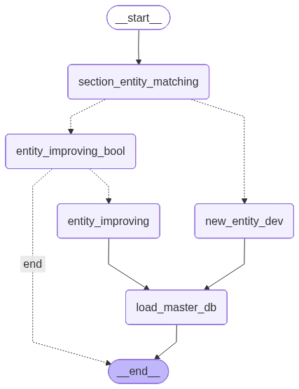

# Knowledge Graph Development for Property & Casualty Insurance

[](https://www.python.org/)
[](https://www.langchain.com/langgraph)
[](https://opensource.org/licenses/MIT)

This repository contains an end-to-end pipeline for building a **Knowledge Graph (KG)** tailored to the **Property & Casualty (P&C) Insurance** domain. The project leverages Large Language Models (LLMs) via LangChain/LangGraph to extract entities, relationships, and structured data from insurance-related documents (e.g., policy documents, claims forms, underwriting guidelines) and construct a scalable knowledge graph for data extraction stored in a vector database (ChromaDB).

The workflow is agent-based, using autonomous LLM agents coordinated through LangGraph state machines to process documents, generate data models, and populate the KG.

## Features

- PDF document ingestion and text extraction (using PyMuPDF)
- Agent-based architecture with custom prompts for domain-specific extraction
- Knowledge graph construction with entity and relationship identification
- Persistent storage in ChromaDB for retrieval-augmented applications
- Modular structure supporting future parallelization and orchestration
- Built with modern Python tooling (uv for dependency management)

## Agentic Workflow for Entity Extraction


## Tech Stack

- **Python 3.12**
- **LangChain** & **LangGraph** – For agent workflows and state management
- **OpenAI** – LLM backend (configurable via environment variables)
- **ChromaDB** – Vector store for the knowledge graph
- **PyMuPDF** – PDF processing
- Other utilities: asyncio, tqdm, scikit-learn, etc.

## Project Structure

```
kg_dev_p-c_insurance/
├── agents/          # LLM agent definitions and logic
├── prompts/         # Prompt templates for entity/relationship extraction
├── src/             # Core source code and utilities
├── states/          # LangGraph state definitions and persistence
├── frontend/        # Streamlit web interface
├── artifacts/       # Generated data (PDFs, PNGs, proto files, ChromaDB)
├── config.py        # Configuration settings (API keys, paths, etc.)
├── main.py          # Entry point to run the full pipeline
├── requirements.txt # Python dependencies
├── pyproject.toml   # Project metadata
├── Dockerfile       # Docker image configuration
├── docker-compose.yml # Docker Compose configuration
├── DEPLOYMENT.md    # Docker deployment guide
├── uv.lock          # Locked dependencies (managed by uv)
├── .gitignore
└── .python-version
```

## Installation

1. Clone the repository:
   ```bash
   git clone https://github.com/shauryat1298/kg_dev_p-c_insurance.git
   cd kg_dev_p-c_insurance
   ```

2. (Recommended) Use `uv` for fast dependency management:
   ```bash
   pip install uv
   uv sync
   ```

   Alternatively, with standard pip:
   ```bash
   uv pip install -r requirements.txt
   ```

3. Set up environment variables (create a `.env` file):
   ```env
   OPENAI_API_KEY=your_openai_key
   ```

## Usage

### Local Development

Run the main pipeline:
```bash
uv python run main.py
```

The script will:
- Load insurance documents (configure paths in `config.py`)
- Execute the LangGraph agent workflow
- Extract entities/relationships
- Build and persist the knowledge graph in ChromaDB

You can customize document sources, prompts, or agent behavior by editing files in `config.py`, `prompts/`, and `agents/`.

### Docker Deployment

The application can be deployed using Docker for easier setup and consistent environments.

**Quick Start:**
```bash
# Create .env file with your API keys
echo "OPENAI_API_KEY=your_key_here" > .env

# Build and start the container
docker-compose up -d

# Access the Streamlit app at http://localhost:8501
```

For detailed Docker deployment instructions, see [DEPLOYMENT.md](DEPLOYMENT.md).

## Development Roadmap

- [x] Base end-to-end workflow
- [x] Full modularization of components
- [x] Parallel data model creation for multiple product lines (e.g., auto, home, commercial)
- [ ] Integration with Apache Airflow for orchestration and data versioning

## Contributing

Contributions are welcome! Feel free to open issues or submit pull requests for improvements, bug fixes, or new features.

## License

This project is licensed under the MIT License – see the [LICENSE](LICENSE) file for details (add one if needed).

---

*Project under active development as of December 2025.*